# 🧷 Utility Tool
This project is a collection of Java-based utility applications with a unified graphical interface. 
Each tool serves a specific purpose, from file management and media conversion to automation and system utilities.

## Features
- A single launcher for multiple tools.
- Modern UI with a consistent theme.
- Multi-threaded execution for performance optimization.
- Various file and media manipulation utilities.
- Uses external libraries like JNativeHook and FFmpeg for advanced functionality.

---

# 1. Auto Clicker
This tool automatically clicks the mouse at a set interval, with an option for randomized delays.

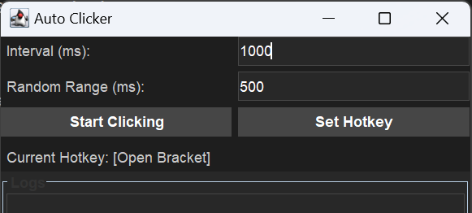

## How to Use
- Set click interval (in milliseconds).
- Set random range (optional) – clicks will happen within this range.
- Start autoclicker by clicking the "Start Clicking" button.
- Use the hotkey to toggle clicking.
## Options
- Interval (ms): Time between clicks.
- Random Range (ms): Adds random variation to prevent detection.
- Hotkey: Can be changed dynamically.
	
---

# 2. Mouse Shadowing
This tool records and replays mouse movements and clicks, optionally capturing keyboard inputs. 
It allows for automation of repetitive tasks by saving and loading recorded actions.

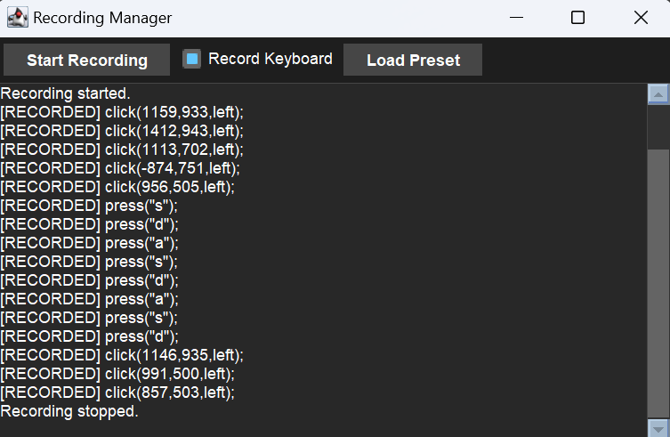

## How to Use
- Click "Start Recording" to begin capturing mouse clicks and movements.
- Enable "Record Keyboard" if you want to capture keystrokes.
- Click "Stop Recording" to end the session.
- Load a saved preset to replay the recorded actions.
- Press Escape (default panic key) to stop the playback immediately.

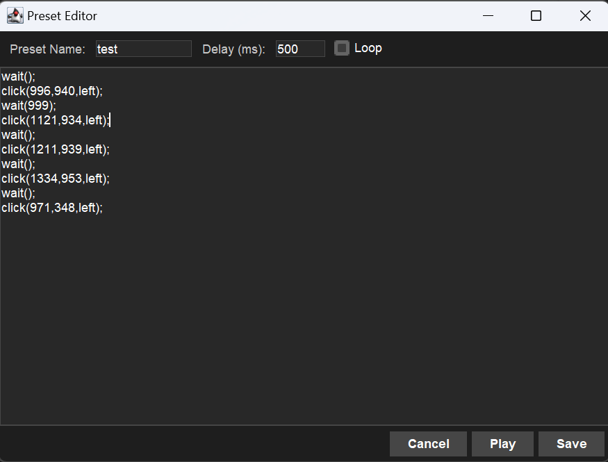

- Change the preset name by editing it.
- Press "Save" to store the recorded actions as a preset for future use.
- Setup the wait() delay (default: 500ms)
- Switch looping option
- Edit the commands directly in a texfield

## Options
- Mouse Tracking: Records all mouse movements and clicks.
- Keyboard Tracking: Captures key presses if enabled.
- Preset Management: Save and load recorded actions for automation.
- Playback Controls: Start, pause, delay between commands, and loop playback of recorded actions.
	
---

# 3. Pixel Monitoring
This tool detects the color of a specific pixel on the screen and monitors it for changes.

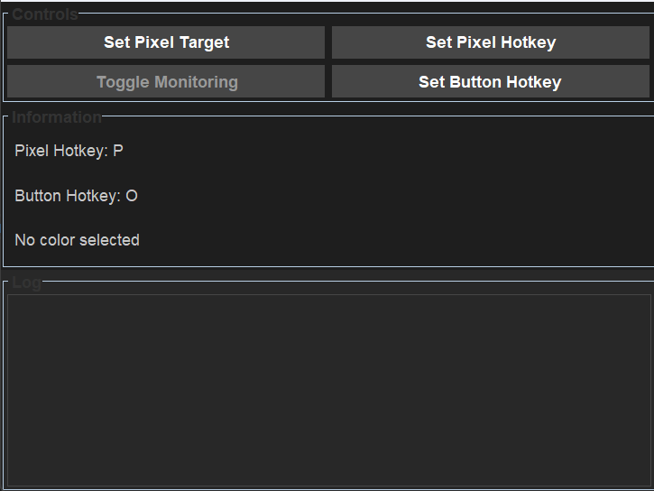

## How to Use
- Click "Set Pixel Target" using hotkey to select a pixel under your mouse.
- The selected color and its coordinates will be displayed.
- Click "Toggle Monitoring" to start tracking the color.
- If the color changes, the tool will trigger a mouse press action.
- Use hotkeys to quickly set the pixel target or toggle monitoring.

Note: Useful for detecting changes in screen elements, automation, and gaming triggers.

(example: monitoring hunger bars in minecraft and automatic eating)

# 4. Auto Clipboard
This tool automatically copies text from a list, and line by line pastes it when pressing CTRL + V.

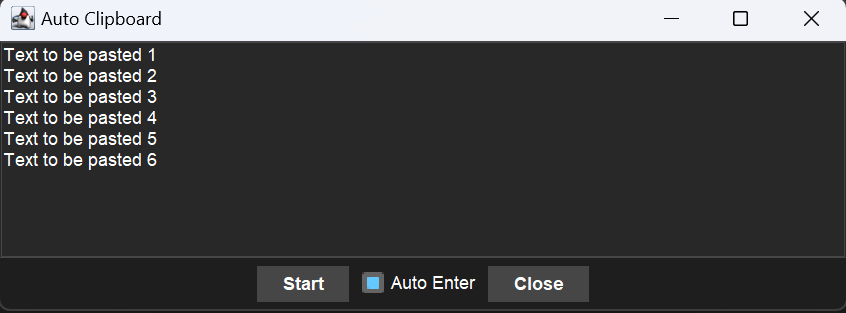

## How to Use
- Paste text into the box (one line per entry).
- Click "Start" to begin copying.
- Use CTRL + V to paste, and the tool will auto-copy the next line.
- Enable "Auto Enter" if you want an ENTER key after each pasting.
	
---

# 5. Pdf Page Combining
This tool merges all pages of a selected PDF file into a single continuous page.

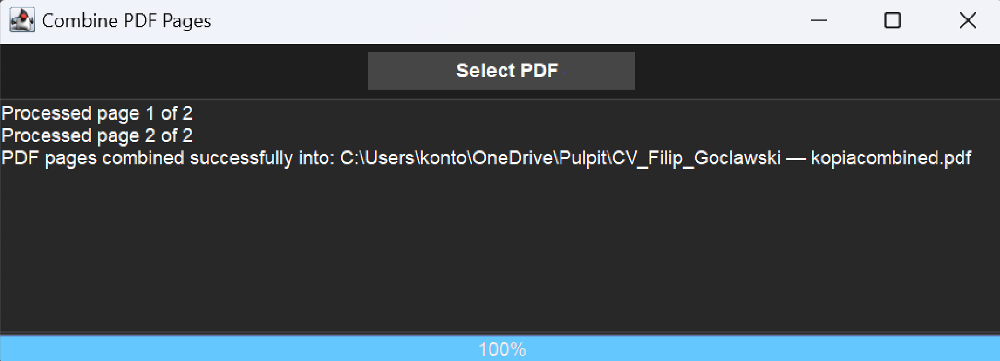

## How to Use
- Click "Select PDF" and choose a file.
- The tool will process the pages and merge them into a single-page PDF.
- The new PDF will be saved in the same folder as the original file with a word "combined" added at the end of its name.
- 
---

# 6. Image Format Converter
This tool allows you to convert image formats between JPG, JPEG, PNG, and WEBP with batch multithreading processing support.

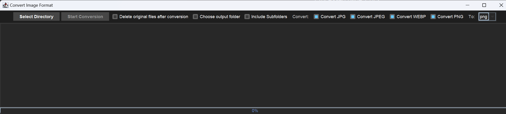
## How to Use
- Click "Select Directory" and choose a folder with images.
- Select which formats to convert (JPG, JPEG, PNG, WEBP).
- Choose the output format (PNG or JPG).
- (Optional) Select:
  - Delete original files after conversion
  - Process subfolders recursively
  - Choose a separate output folder
- Click "Start Conversion" to begin.

# 7. File Unziper
This tool uses multithreading to automate extracting and optionally deleting archive files (ZIP, RAR, 7Z) in a directory.

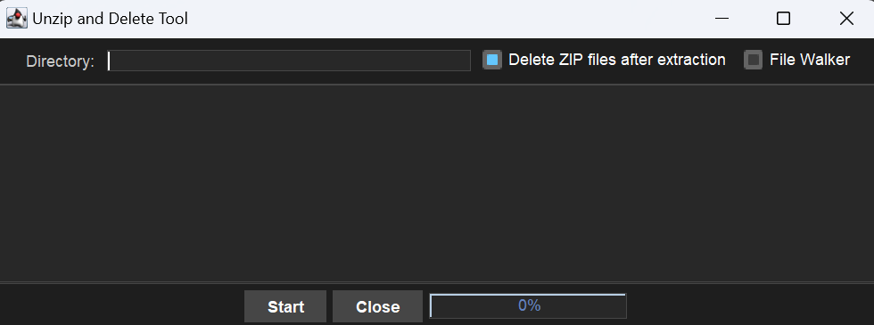

## How to Use
- Select the directory containing compressed files.
- Choose options:
  - Delete ZIP after extraction (optional).
  - Enable File Walker to scan subdirectories.
- Click "Start" to begin extraction.
- The tool extracts each file to its own folder.

Note: Ensure 7-Zip (7z) is installed and added to the system path for the extraction to work properly.

---

# 8. File Mover
This tool moves all files from one directory to another based on file extensions.

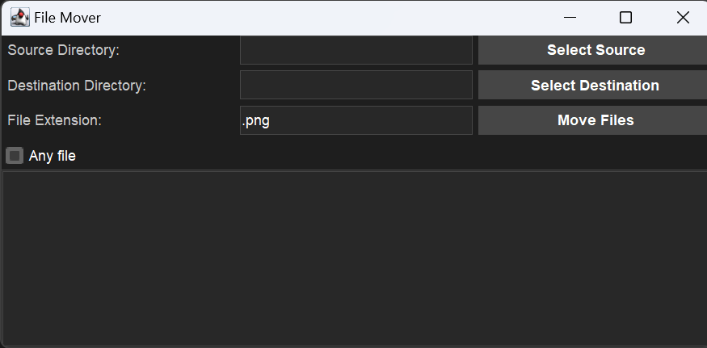
## How to Use
- Select the source directory containing the files.
- Select the destination directory where the files will be moved.
- Enter the file extension (e.g., .png, .txt).
- Enable "Any file" if you want to move all files regardless of extension.
- Click "Move Files" to start the process.

---

# 9. File Renamer
This tool renames all files in a selected folder to a sequential numerical order, maintaining their extensions.

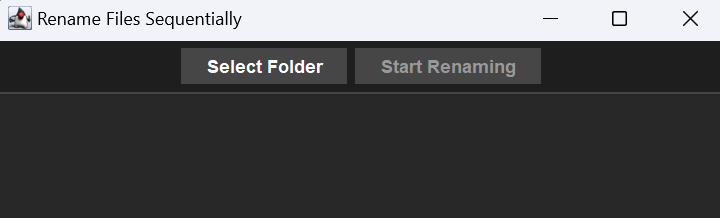
## How to Use
- Click "Select Folder" and choose a directory containing the files.
- Click "Start Renaming" to rename all files sequentially.
- Files are renamed in order of modification date, starting from 1.extension, 2.extension, etc.

Note: Ideal for organizing photos, documents, and other files in a numbered order.
	
---

# 10. Rename Plex Media
This tool renames TV show directories and media files in a structured season-episode format.

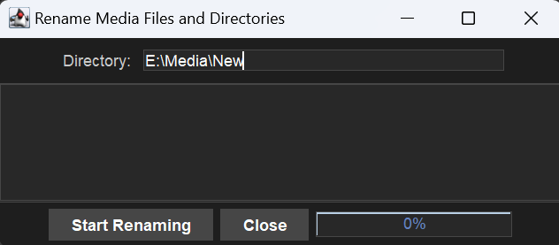

## How to Use
- Enter or select the directory containing media files.
- Click "Start Renaming" to organize the folders and files.
- The tool will:
- Rename season folders as S01, S02, etc.
- Rename files within each folder to match the format s01e01.extension, s01e02.extension, etc.
- Progress is displayed in the log window.

---

# 11. File Name Shortener
This tool renames files and folders that exceed a specified length by truncating their names while preserving file extensions.

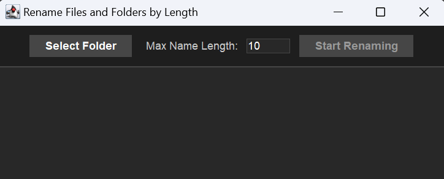

## How to Use
- Select the folder containing the files/folders.
- Set the maximum name length.
- Click "Start Renaming" to begin processing.
- Files and folders exceeding the length limit will be renamed automatically.
- If a name conflict occurs, a number suffix is added to the new name. 

Note:
Useful for managing files with overly long names that cause compatibility issues with certain software or operating systems.

---

# 12. Video audio extractor
This tool extracts audio from MP4 videos and converts it to MP3 or WAV format.

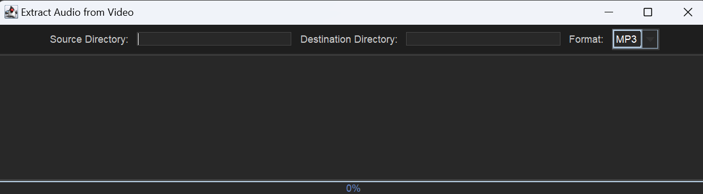

## How to Use
- Select the source directory containing MP4 files.
- Select the destination directory where extracted audio will be saved.
- Choose the output format (MP3 or WAV).
- Click "Start Extraction" to begin.
- The progress bar will update as files are processed.

Note: FFmpeg must be installed and added to the system path for this tool to work.

---

# 13. Remove Silent Audio
This tool uses multithreading to analyze audio files and remove those that are silent or contain only static noise.

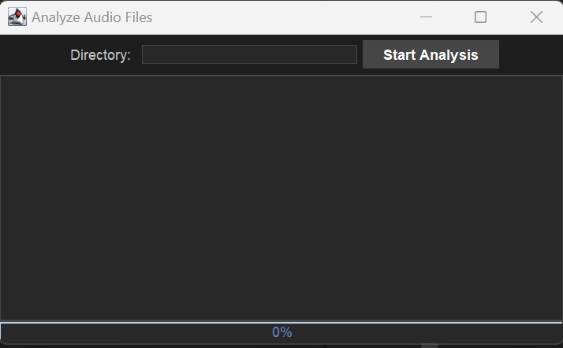

## How to Use
- Select the directory containing the audio files.
- Click "Start Analysis" to begin scanning files.
- The tool uses FFmpeg to measure audio levels.
- If a file is detected as silent or static, it is automatically deleted.
- The log displays details about analyzed files.

This tool is useful for cleaning up recordings, podcast files, or audio libraries by removing unnecessary silent tracks.

---

# 14. Combine Audio Files

This tool merges multiple audio files into a single file using FFmpeg.

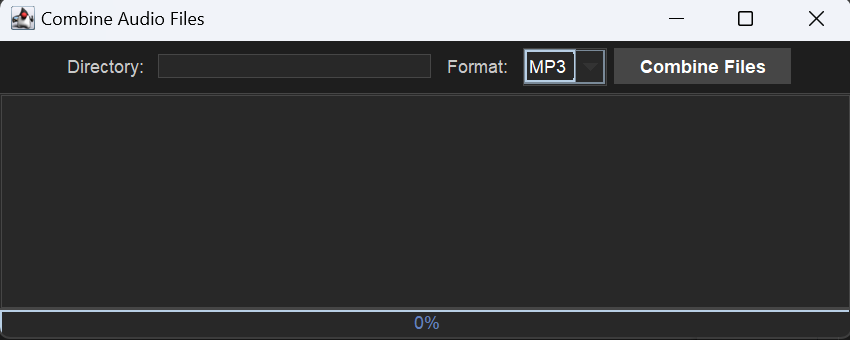

# How to Use
- Select a folder containing audio files.
- Choose the audio files format (MP3 or WAV).
- Click "Combine Files" to merge all files in the selected directory.
- The combined file will be saved in the same directory.
- Program will displays real-time logs and progress.

Note: FFmpeg must be installed and added to the system path for this tool to work.
